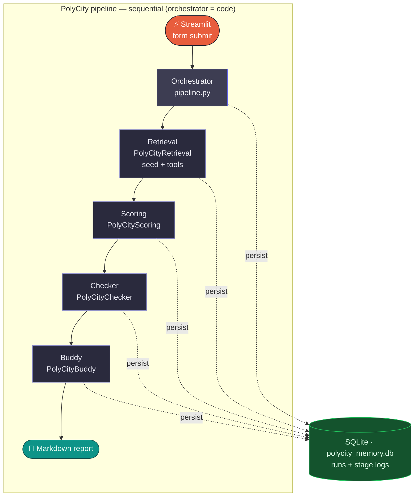

# PolyCity Stay — Architecture (submission brief)

## Pattern

**Hierarchical orchestration + sequential pipeline:** a single Python entrypoint runs **four specialist agents** in order. There is no single “manager” LLM that delegates via handoffs; the **orchestrator is code** (`pipeline.py`), which matches the course idea of *central coordination* while keeping control flow explicit for debugging and demos.

The diagram below is laid out like a **node canvas** (similar to n8n / Make): trigger on the left, steps left-to-right, and a **data store** wired underneath. Unlike a *parallel* lead-qualification workflow, this MVP is **strictly sequential**—each stage consumes the previous output.

*Solid arrows = control / data flow. Dashed arrows = each stage (and the orchestrator) writes to shared memory.*

## Agents and responsibilities

| Agent | Type (course vocabulary) | Role |
|-------|-------------------------|------|
| **PolyCityRetrieval** | Retrieval (+ tools) | Loads `data/seed_hotels.json` via tool; optional HTTPS fetch for extra text. |
| **PolyCityScoring** | Analysis | Scores / ranks vs user prefs (MTR walk, shower, desk, budget). |
| **PolyCityChecker** | Verification | Sanity-checks JSON, flags uncertainty / human confirmation. |
| **PolyCityBuddy** | Creation | Writes student-facing Markdown (tone + emojis), with disclaimers. |

## Tools

- `list_seed_hotels_for_campus` — JSON seed rows for **cityu** or **polyu** (bound at run time).
- `fetch_webpage_text` — optional `httpx` + HTML→text (may fail on bot protection).

## Shared memory

SQLite file (default `polycity_memory.db`): each run stores **prefs**, **four stage outputs**, and optional **error** text; `logs` table supports lightweight tracing.

## External services

- **Ollama** at OpenAI-compatible `OLLAMA_BASE_URL` (default `http://127.0.0.1:11434/v1`), model from `OLLAMA_MODEL` (e.g. `qwen2.5:7b`).
- **Tracing** disabled for local runs (no OpenAI platform key required).

## Error handling

- Exceptions in any stage are caught, stringified into `error`, and persisted so the UI can show a friendly message while keeping partial outputs when useful.

## Loose JSON parsing

- `polycity_stay/json_utils.py` strips markdown fences, extracts the first balanced `{...}` / `[...]` (string-aware), then `json.loads`.
- When parsing succeeds, downstream agents receive **pretty-printed JSON**; when it fails, they receive a **labelled raw** block so the run continues instead of breaking on malformed local-model output.

## Report rendering (Streamlit)

- `report_styles_html()` and `enhance_buddy_markdown()` are emitted in **two separate** `st.markdown(..., unsafe_allow_html=True)` calls. Prepending `<style>` to the same string as the report body prevents Markdown from rendering (raw `#`, `**` visible), especially with Chinese text.

---

*PolyCity Stay — Kowloon MVP for CityU & PolyU long-stay hotel scouting.*
