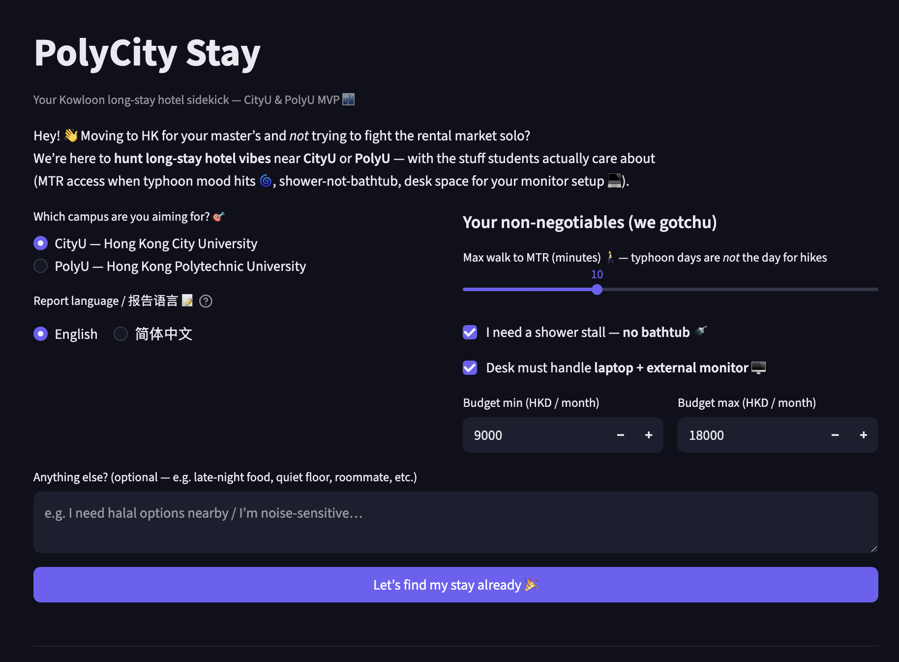

# PolyCity Stay 🏙️

**Kowloon 🇭🇰 long-stay hotel scout for master’s students** — because fighting HK rental listings at 2am is *not* the vibe. Pick **CityU** or **PolyU**, dial in your MTR / shower / desk / budget non-negotiables, and let a small team of agents dig through seed data (plus optional page fetch) to spit out a ranked, emoji-friendly report. Typhoon day? Near the MTR. External monitor? They’ll side-eye the desk notes. Milk tea not included 🧋

Under the hood it’s a **Python** app: **OpenAI Agents SDK** + **Ollama** (default `qwen2.5:7b`) + **SQLite** so runs don’t vanish into the void. Report language: **English** or **简体中文** — hotel names show **English · 简体** for easy copy-paste to maps and chats.

**UI:** Streamlit form — campus, report language, MTR / shower / desk / budget, and optional notes.



---

## Architecture

- **Pattern:** Hierarchical / sequential pipeline — Retrieval → Scoring → Verification → Buddy (student-facing Markdown).
- **Agents:** `PolyCityRetrieval`, `PolyCityScoring`, `PolyCityChecker`, `PolyCityBuddy`.
- **Tools:** Seed JSON per campus + optional `fetch_webpage_text` for extra context.
- **Memory:** `polycity_memory.db` stores each run and stage outputs.

More detail: [`ARCHITECTURE.md`](ARCHITECTURE.md). Demo screenshots live in [`demo/`](demo/).

---

## Setup

1. Install [Ollama](https://ollama.com/) and pull the model:

   ```bash
   ollama pull qwen2.5:7b
   ```

2. From this folder:

   ```bash
   cp .env.example .env
   uv sync
   uv run streamlit run app.py
   ```

3. Open the local URL Streamlit prints (usually http://localhost:8501).

Choose **report language** (English / **简体中文**) in the form; the Buddy agent writes the final Markdown in that language, and scoring JSON blurbs follow it in nerd mode.

---

## Notes

- Seed hotels in `data/seed_hotels.json` are **demo / illustrative** — always confirm with the hotel before paying. Each row has **`name_en`**, **`name_zh`** (**简体中文** hotel names for reference), and **`name`** (`English · 中文`) for display.
- Live `fetch_webpage_text` may fail on bot protection; the pipeline still works from seed data.

---

## Theme

Custom Streamlit theme (indigo primary) lives in `.streamlit/config.toml` — run `streamlit run app.py` from this directory so it loads.
